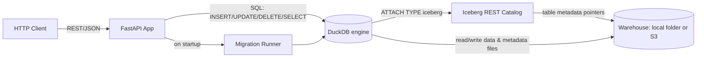
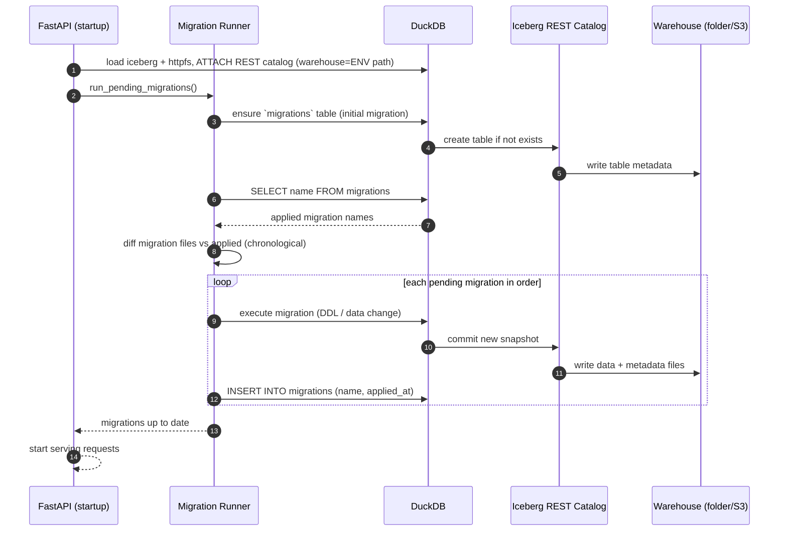
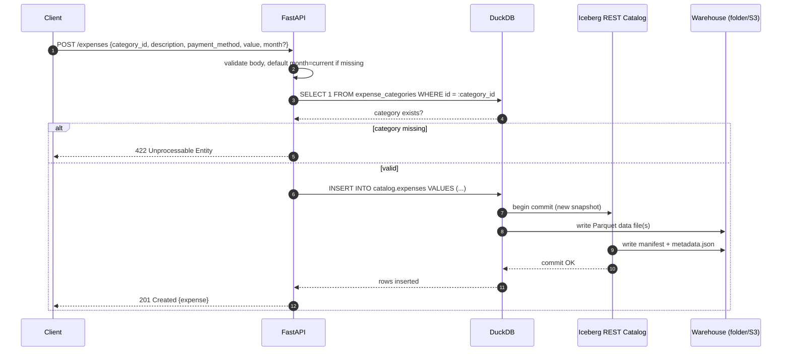
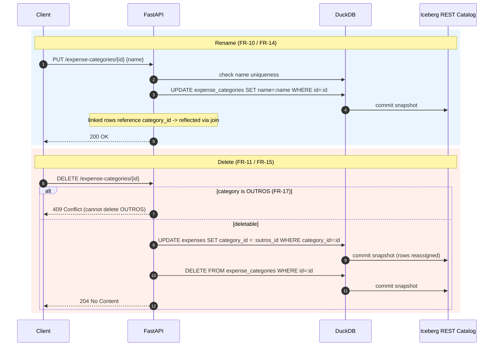
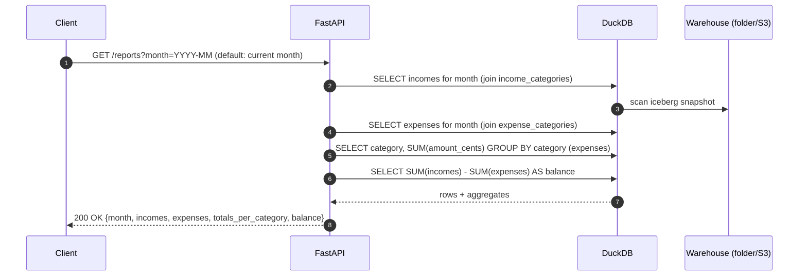

# Financial Management Back-End — Technical Design

A single-user personal **financial management** back-end written in **Python**
with **FastAPI**, using **DuckDB** for reads/aggregation and **Apache Iceberg**
(written natively by **DuckDB** through an attached **Iceberg REST catalog**) as
the storage model. The project doubles as a hands-on study of **DuckDB-native
Iceberg writes** so the pattern can be reused on higher-throughput projects.

---

## Overview

### Objective

Provide an HTTP API to record and manage a single user's **expenses** and
**incomes**, organize them by **categories**, and produce a **monthly report**
containing every income and expense for the month, the **total expense per
category**, and the **final month balance**.

The data layer is intentionally built on **DuckDB + Apache Iceberg** to exercise
and demonstrate how DuckDB performs **native Iceberg writes** (`INSERT` /
`UPDATE` / `DELETE`) against an Iceberg table managed by a REST catalog, with a
warehouse that can live on a **local folder** or in **AWS S3**.

### Scope

**Included**

- CRUD for **expenses** (category, description, payment method, value, month).
- CRUD for **incomes** (description, value, month, optional category).
- CRUD for **expense categories** and **income categories** (with unique names).
- **Monthly report** (incomes, expenses, total expense per category, balance).
- A custom, file-based **schema migration system** run automatically on startup.
- Storage on **DuckDB + Iceberg**, warehouse path provided by an environment
  variable (local folder **or** S3), via a **local Iceberg REST catalog**.

**Excluded (non-goals)**

- **Authentication / authorization** — single user, no auth.
- **Multi-user / multi-tenant** support.
- Multi-currency: all monetary values are **BRL**.
- Budgets, recurring transactions, attachments, analytics dashboards, exports.
- High availability, horizontal scaling, and hard SLAs (best-effort local
  experiment).
- A front-end / UI (HTTP API only).

---

## Functional and Non-Functional Requirements

### Functional Requirements

**Expenses**

- **FR-1** — Add an expense with `category`, `description`, `payment_method`,
  `value`, and `month`. If `month` is omitted, default to the **current month**.
- **FR-2** — Edit an existing expense.
- **FR-3** — Delete an existing expense.

**Incomes**

- **FR-4** — Add an income with `value`, `month`, a `category`, and an optional
  `description`. If `month` is omitted, default to the **current month**; if
  `category` is omitted, default to the `OUTROS` income category. `description`
  is **optional**.
- **FR-5** — Edit an existing income.
- **FR-6** — Delete an existing income.

**Reporting**

- **FR-7** — Produce a report for a specific `month` (default: current month).
  The report contains **all incomes**, **all expenses**, the **total expense
  value per category**, and the **final month balance**
  (`sum(incomes) − sum(expenses)`).

**Expense categories**

- **FR-8** — List expense categories.
- **FR-9** — Create an expense category.
- **FR-10** — Update an existing expense category; all expenses linked to it must
  reflect the new value.
- **FR-11** — Delete an existing expense category; all expenses linked to it are
  **reassigned to the `OUTROS` expense category**.

**Income categories**

- **FR-12** — List income categories.
- **FR-13** — Create an income category.
- **FR-14** — Update an existing income category; all incomes linked to it must
  reflect the new value.
- **FR-15** — Delete an existing income category; all incomes linked to it are
  **reassigned to the `OUTROS` income category**.

**Constraints**

- **FR-16** — Expense category **names are unique**; income category **names are
  unique**.
- **FR-17** — A seeded `OUTROS` category exists for both expense and income
  categories and **cannot be deleted** (it is the delete-cascade fallback).
- **FR-18** — On startup, the application **runs all pending migrations** in
  chronological order before serving traffic.

> **Note on the rename vs. delete cascade.** Because rows reference categories by
> **`category_id`** (normalized FK), a category **rename** (FR-10/FR-14) is a
> single-row update and is automatically reflected by report joins — no row
> rewrite needed. A category **delete** (FR-11/FR-15) issues a real DuckDB
> `UPDATE` that reassigns the affected rows' `category_id` to `OUTROS`, which is
> what exercises DuckDB-native Iceberg writes.

### Non-Functional Requirements

- **NFR-1 — Storage location** — DuckDB and Iceberg data are persisted under the
  path set by an environment variable. The path may be a **local folder** or an
  **AWS S3** location (`s3://…`).
- **NFR-2 — Unique category names** — enforced for expense and income categories
  independently (see FR-16).
- **NFR-3 — Startup migrations** — schema is created/evolved exclusively via the
  migration runner on startup (idempotent; safe to run repeatedly).
- **NFR-4 — Best effort otherwise** — no hard targets for latency, throughput,
  availability, or concurrency. Single-user, single-process, local experiment.
- **NFR-5 — Portability** — the REST-catalog approach supports both local-folder
  and S3 warehouses without changing application code.

---

## Data Flow

### Architecture at a glance



- **FastAPI** exposes the REST routes and orchestrates use cases.
- **DuckDB** is the single SQL engine for **both** reads and **native Iceberg
  writes**. It loads the `iceberg` (and `httpfs` for S3) extensions and
  `ATTACH`es the Iceberg **REST catalog**.
- The **Iceberg REST catalog** owns table metadata and points at the
  **warehouse** (the env-var path). DuckDB reads/writes the actual Parquet data
  files and Iceberg metadata in the warehouse.

### Step 1 — Application startup & migration runner

The migration system is file-based:

- Migration files live in a `migrations/` directory, named
  **`{timestamp}-{migration_name}`** (e.g.
  `20260101000000-create_migrations_table`). The timestamp prefix guarantees
  chronological ordering.
- The **initial migration** creates the `migrations` table **if it does not
  exist** and registers **its own filename** in it (if not already registered).
- On every startup, the runner lists all migration files, finds those **not yet
  registered** in the `migrations` table, and for each (in chronological order)
  **executes** it and **records** its filename.



### Step 2 — Add an expense (DuckDB-native Iceberg write)



> Edit (`PUT /expenses/{id}`) and delete (`DELETE /expenses/{id}`) follow the
> same shape using DuckDB `UPDATE` / `DELETE` statements, each producing a new
> Iceberg snapshot. Incomes mirror this flow.

### Step 3 — Update / delete a category (cascade)



### Step 4 — Monthly report (DuckDB read/aggregation)



---

## Data Sources

| Source | Type | Endpoint / Location | Authentication | Rate limit / Notes |
|---|---|---|---|---|
| Iceberg warehouse | Object/file storage | `ICEBERG_WAREHOUSE` env var — local folder path **or** `s3://bucket/prefix` | None (local FS) / **AWS credentials** for S3 | Holds Parquet data + Iceberg metadata. No app-level rate limit; S3 request costs apply. |
| Iceberg REST catalog | Iceberg REST catalog service | `ICEBERG_REST_URI` (e.g. `http://localhost:8181`) | Catalog-dependent (none for the local fixture; token/OAuth for Lakekeeper/Polaris) | Run locally (e.g. `apache/iceberg-rest-fixture`, Lakekeeper, or Polaris via Docker). Owns table metadata pointers. |
| DuckDB engine | Embedded SQL engine | In-process (optional local `.duckdb` file for session state) | None | Loads `iceberg` + `httpfs` extensions; performs all reads and native Iceberg writes. |
| Migration files | Local filesystem | `migrations/` directory | None | Named `{timestamp}-{name}`; executed in chronological order on startup. |

### Relevant environment variables

| Variable | Required | Example | Purpose |
|---|---|---|---|
| `ICEBERG_WAREHOUSE` | Yes | `/data/warehouse` or `s3://my-bucket/finance` | Warehouse root for Iceberg data + metadata. |
| `ICEBERG_REST_URI` | Yes | `http://localhost:8181` | Iceberg REST catalog endpoint DuckDB attaches to. |
| `ICEBERG_CATALOG_NAME` | No | `finance` | Name used in the DuckDB `ATTACH` and qualified table names. |
| `AWS_ACCESS_KEY_ID` / `AWS_SECRET_ACCESS_KEY` / `AWS_REGION` | If S3 | — | Credentials for S3-backed warehouses (`httpfs`). |

---

## Data Contracts

All monetary values are transported as **integer cents** (`amount_cents`,
currency **BRL**) to avoid floating-point rounding. `month` is a string in
**`YYYY-MM`** format. IDs are server-generated.

### Enumerations

- **`payment_method`** (expenses): `CASH`, `CREDIT_CARD`, `DEBIT_CARD`, `PIX`,
  `BANK_TRANSFER`.

### Iceberg table schemas

**`migrations`**

| Field | Type | Notes |
|---|---|---|
| `name` | VARCHAR | Migration filename, unique; primary identifier. |
| `applied_at` | TIMESTAMP | When the migration was applied. |

Expense and income categories are kept in **two separate tables** so that names
are unique *within each kind* (an expense category and an income category may
share a name) and each kind has its own `OUTROS` fallback row.

**`expense_categories`**

| Field | Type | Validations |
|---|---|---|
| `id` | BIGINT | Server-generated, unique. |
| `name` | VARCHAR | Required, **unique** within `expense_categories`, non-empty. |

**`income_categories`**

| Field | Type | Validations |
|---|---|---|
| `id` | BIGINT | Server-generated, unique. |
| `name` | VARCHAR | Required, **unique** within `income_categories`, non-empty. |

**`expenses`**

| Field | Type | Validations |
|---|---|---|
| `id` | BIGINT | Server-generated. |
| `category_id` | BIGINT | Required; must reference an existing expense category. |
| `description` | VARCHAR | Required, non-empty. |
| `payment_method` | VARCHAR | Required; one of the `payment_method` enum. |
| `amount_cents` | BIGINT | Required; `> 0`. Integer cents (BRL). |
| `month` | VARCHAR(7) | `YYYY-MM`; defaults to current month if omitted. |
| `created_at` | TIMESTAMP | Server-set. |
| `updated_at` | TIMESTAMP | Server-set on edit. |

**`incomes`**

| Field | Type | Validations |
|---|---|---|
| `id` | BIGINT | Server-generated. |
| `category_id` | BIGINT | **Required**; references an income category. Defaults to the `OUTROS` income category when omitted. |
| `description` | VARCHAR | **Optional**; may be null/empty. |
| `amount_cents` | BIGINT | Required; `> 0`. Integer cents (BRL). |
| `month` | VARCHAR(7) | `YYYY-MM`; defaults to current month if omitted. |
| `created_at` | TIMESTAMP | Server-set. |
| `updated_at` | TIMESTAMP | Server-set on edit. |

### API endpoints

| Method | Path | Story | Description |
|---|---|---|---|
| POST | `/expenses` | FR-1 | Create an expense (defaults `month`). |
| PUT | `/expenses/{id}` | FR-2 | Edit an expense. |
| DELETE | `/expenses/{id}` | FR-3 | Delete an expense. |
| POST | `/incomes` | FR-4 | Create an income (defaults `month`, `category`). |
| PUT | `/incomes/{id}` | FR-5 | Edit an income. |
| DELETE | `/incomes/{id}` | FR-6 | Delete an income. |
| GET | `/reports` | FR-7 | Monthly report (`?month=YYYY-MM`, default current). |
| GET | `/expense-categories` | FR-8 | List expense categories. |
| POST | `/expense-categories` | FR-9 | Create an expense category. |
| PUT | `/expense-categories/{id}` | FR-10 | Rename an expense category. |
| DELETE | `/expense-categories/{id}` | FR-11 | Delete; reassign rows to `OUTROS`. |
| GET | `/income-categories` | FR-12 | List income categories. |
| POST | `/income-categories` | FR-13 | Create an income category. |
| PUT | `/income-categories/{id}` | FR-14 | Rename an income category. |
| DELETE | `/income-categories/{id}` | FR-15 | Delete; reassign rows to `OUTROS`. |

### Examples

**Create expense — request (`POST /expenses`)**

```json
{
  "category_id": 3,
  "description": "Supermercado",
  "payment_method": "PIX",
  "amount_cents": 15990,
  "month": "2026-06"
}
```

**Create expense — response `201`**

```json
{
  "id": 42,
  "category_id": 3,
  "description": "Supermercado",
  "payment_method": "PIX",
  "amount_cents": 15990,
  "month": "2026-06",
  "created_at": "2026-06-21T13:45:00Z",
  "updated_at": "2026-06-21T13:45:00Z"
}
```

**Create income — request (`POST /incomes`)** (no `month`, no `category` → defaults)

```json
{
  "description": "Salário",
  "amount_cents": 850000
}
```

**Monthly report — response `200` (`GET /reports?month=2026-06`)**

```json
{
  "month": "2026-06",
  "incomes": [
    { "id": 7, "category": "OUTROS", "description": "Salário", "amount_cents": 850000 }
  ],
  "expenses": [
    { "id": 42, "category": "Alimentação", "description": "Supermercado", "payment_method": "PIX", "amount_cents": 15990 },
    { "id": 43, "category": "Transporte", "description": "Combustível", "payment_method": "CREDIT_CARD", "amount_cents": 20000 }
  ],
  "totals_per_category": [
    { "category": "Alimentação", "total_cents": 15990 },
    { "category": "Transporte", "total_cents": 20000 }
  ],
  "balance_cents": 814010
}
```

**Create category — request (`POST /expense-categories`)**

```json
{ "name": "Alimentação" }
```

---

## External Dependencies

| Service / Component | Purpose | Auth type | Notes |
|---|---|---|---|
| **DuckDB** (`duckdb` + `iceberg`, `httpfs` extensions) | SQL engine for reads and **native Iceberg writes** | None | Core of the experiment; performs `ATTACH` to the REST catalog. |
| **Iceberg REST catalog** (`apache/iceberg-rest-fixture` / Lakekeeper / Polaris) | Manages Iceberg table metadata; required for DuckDB-native writes | None (fixture) / token/OAuth (others) | Run locally via Docker; warehouse points at `ICEBERG_WAREHOUSE`. |
| **FastAPI** (+ Uvicorn) | HTTP routing, request validation, app lifecycle | None | Runs migrations on startup before serving. |
| **Pydantic** | Request/response models and validation | — | Enforces enums, required fields, `> 0`, `YYYY-MM`. |
| **AWS S3** (optional) | Warehouse storage when `ICEBERG_WAREHOUSE` is `s3://…` | AWS credentials | Accessed by DuckDB via `httpfs`; not used for local-folder warehouses. |

---

## Versioning

| Version | Date | Changes | Authors |
|---|---|---|---|
| v1.0.0 | 2026-06-21 | Initial technical design: overview/scope, functional & non-functional requirements, data flow (startup migrations, expense write, category cascade, monthly report), data sources, data contracts (schemas, endpoints, examples), external dependencies. DuckDB-native Iceberg writes via a local Iceberg REST catalog; warehouse on local folder or S3. | Igor Emerick |
